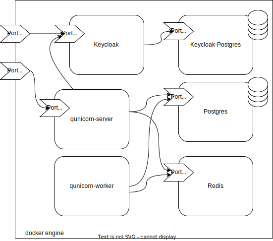

# The Qunicorn Core - Unification Middleware for a sovereign Quantum Cloud

[](https://github.com/psf/black)
[](https://opensource.org/licenses/Apache-2.0)

[](https://github.com/SeQuenC-Consortium/qunicorn-core/actions/workflows/formatting-linting.yml)
[](https://github.com/SeQuenC-Consortium/qunicorn-core/actions/workflows/run-pytests.yml)

This package uses Poetry ([documentation](https://python-poetry.org/docs/)).

## VSCode

For vscode install the python extension and add the poetry venv path to the folders the python extension searches for
venvs.

On linux:

```json
{
  "python.venvFolders": [
    "~/.cache/pypoetry/virtualenvs"
  ]
}
```

## Development

Run `poetry install` to install dependencies.

### Environment variables

The flask dev server loads environment variables from `.flaskenv` and `.env`.
To override any variable create a `.env` file.
Environment variables in `.env` take precedence over `.flaskenv`.
See the content of the `.flaskenv` file for the default environment variables.

You can also add an `IBM_TOKEN` to the `.env` file to use the IBM backend without a token in each request.
Set the `EXECUTE_CELERY_TASK_ASYNCHRONOUS` in your .env file to False, if you don't want to start a
celery worker and execute all tasks synchronously.

### Available endpoints are:

* **JOBS**
    * **POST /jobs/** *(Create/Register and run new job)*
        * Needs a valid token to connect to IBM
        * Runs asynchronously so the results are not shown in the api response
    * **GET /jobs/** *(Get all jobs)*
    * **GET /jobs/{job_id}/** *(Get details/results of a job)*
    * **DELETE /jobs/{job_id}/** *(Get details/results of a job)*
    * **POST /jobs/run/{job_id}/** *(Executes an uploaded python file)*
    * **POST /jobs/rerun/{job_id}/** *(Copies and Runs again an existing Job)*
    * **GET /jobs/{deployment_id}/** *(Get all jobs with the given deploymentId)*
    * **DELETE /jobs/{deployment_id}/** *(Delete all jobs with the given deploymentId)*

* **DEPLOYMENTS**
    * **GET /deployments/** *(Get all Deployments)*
    * **POST /deployments/** *(Create a Deployment)*
    * **GET /deployments/{deployment_id}/** *(Gets a Deployment)*
    * **PUT /deployments/{deployment_id}/** *(Update a Deployment)*
    * **DELETE /deployments/{deployment_id}/** *(Deletes a Deployment)*

* **DEVICES**
    * **GET /devices/** *(Get all currently saved devices)*
    * **PUT /devices/** *(Updates the devices, by retrieving them from IBM)*
    * **PUT /devices/{device_id}/** *(Get details about one device)*
    * **PUT /devices/{device_id}/status** *(To check if a device is running)*
    * **PUT /devices/{device_id}/calibration** *(To get some device properties)*

### Run manually

Run the development server with

```bash
poetry run flask run
```

Start Docker, init the celery worker and then start it

```bash
poetry run invoke start-broker
poetry run invoke worker
```

Create the initial database (If this doesn't work, try to delete the db-file from the "instance" folder)

```bash
flask recreate-and-load-db
```

Check Linting Errors

```bash
poetry run invoke check-linting
```

Trying out the tests -> See tests/README.md

```bash
poetry run pytest .
```

### Run using docker-compose

Execute the following command the deployment will be started using docker-compose. This will build the dockerimage
containing the application and creates all required containers including the database and the message queue.

Note that you might need to authorize with an Access Token in order to access the qunicorn package on GitHub.
In this Case the following steps need to be performed.

1. Create a personal access token on Github (Account --> Settings --> Developer Settings --> Personal acces tokens)
2. Execute:
    ```bash
   echo PUT_PERSONAL_ACCESS_TOKEN_HERE | docker login ghcr.io -u USERNAME --password-stdin
   ```

Start the docker-compose:

```bash
docker-compose up -d
```

For testing with a local build use:

```bash
docker-compose -f docker-compose.yaml -f docker-compose.local.yaml up -d
```



### Trying out the Template

For a list of all dependencies with their license open <http://localhost:5005/licenses/>.
The Port for qunicorn_core is set to 5005 to not interfere with other flask default apps.
Settings can be changed in the .flaskenv.

#### The API:

<http://localhost:5005/>

#### OpenAPI Documentation:

Configured in `qunicorn_core/util/config/smorest_config.py`.

* Redoc (view only): <http://localhost:5005/redoc>
* Rapidoc: <http://localhost:5005/rapidoc>
* Swagger-UI: <http://localhost:5005/swagger-ui>
* OpenAPI Spec (JSON): <http://localhost:5005/api-spec.json>

#### Debug pages:

* Index: <http://localhost:5005/debug/>
* Registered Routes: <http://localhost:5005/debug/routes>\
  Useful for looking up which endpoint is served under a route or what routes are available.

#### Remarks

For more detailed information about additional commands see the readme.md in docs.

## Disclaimer of Warranty

Unless required by applicable law or agreed to in writing, Licensor provides the Work (and each Contributor provides its
Contributions) on an "AS IS" BASIS, WITHOUT WARRANTIES OR CONDITIONS OF ANY KIND, either express or implied, including,
without limitation, any warranties or conditions of TITLE, NON-INFRINGEMENT, MERCHANTABILITY, or FITNESS FOR A
PARTICULAR PURPOSE. You are solely responsible for determining the appropriateness of using or redistributing the Work
and assume any risks associated with Your exercise of permissions under this License.

## Haftungsausschluss

Dies ist ein Forschungsprototyp. Die Haftung für entgangenen Gewinn, Produktionsausfall, Betriebsunterbrechung,
entgangene Nutzungen, Verlust von Daten und Informationen, Finanzierungsaufwendungen sowie sonstige Vermögens- und
Folgeschäden ist, außer in Fällen von grober Fahrlässigkeit, Vorsatz und Personenschäden, ausgeschlossen.

## Acknowledgements

The initial code contribution has been supported by the
project [SeQuenC](https://www.iaas.uni-stuttgart.de/forschung/projekte/sequenc/).
