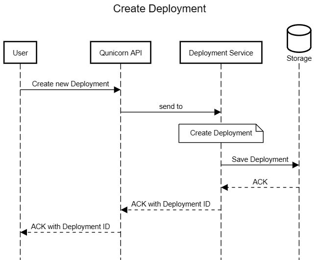
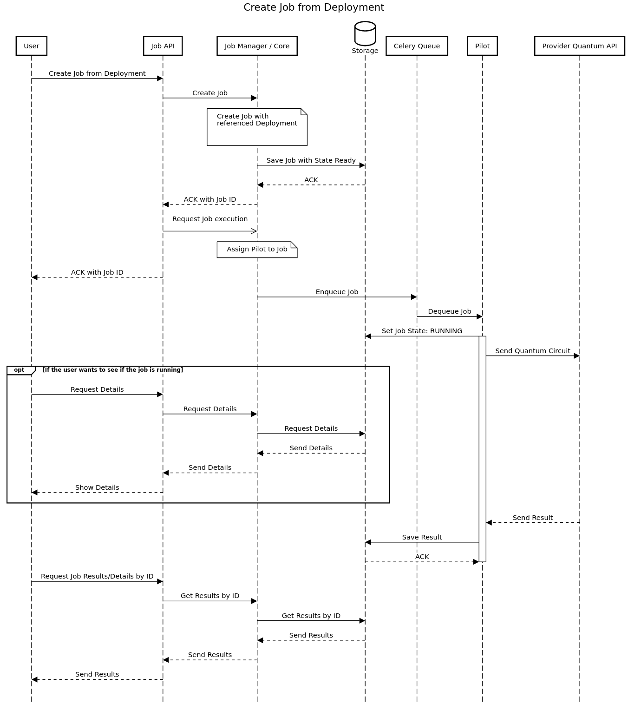

Architecture Overview
=========================================

Vision
-------

The following two diagrams represent the vision which was set out for qunicorn.

Context
^^^^^^^^

The quantum unification layer is the middleware between the user / service orchestration and the Infrastructure providers.
These contain providers like AWS and IBM.
The Context describes the surrounding components and APIs in which qunicorn is embedded.

.. image:: ../resources/images/highLevelComponents.png
  :width: 700
  :alt: High Level Components

Architecture
^^^^^^^^^^^^^^^^^^^^^^^^^^^

The general architecture described here visualizes the different planes and components of qunicorn.
As well as given a brief overview of the functionality.

.. image:: ../resources/images/architecture.png
  :width: 700
  :alt: Architecture

Component Overview and Interactions
-------------------------------------

The concrete architecture of qunicorn is based on the initial vision.
This component diagram visualizes the different components and their interactions.

The API implements different Endpoints for Jobs, Deployments, Devices and Providers.
More details on the API can be found here: :doc:`API Documentation <./api_documentation/main_apidocumentation>`.

Details on the Pilot Manager and Transpiler can be found in the :doc:`Pilot and Transpiler Documentation <../pilot_documentation/main_pilot_documentation>`.

Details on the Database can be found in the :doc:`Database Documentation <./database_documentation/main_database>`.

.. image:: ../resources/images/qunicorn_component_interaction.png
  :width: 800
  :alt: Alternative text

Domain model
----------------------

The domain model of qunicorn defines the different entities which are used. This mainly contains the Job description and definition of Quantum programs within deployments.
These are used as a data source for the different components of qunicorn.

.. image:: ../resources/images/qunicorn_domain_model.png
  :width: 700
  :alt: Alternative text

For more information you can refer to the database documention, which can be found here:
:doc:`Database Documentation <./database_documentation/main_database>`.

Sequence Diagram for Creating a Deployment
--------------------------------------------

hgrHqKbSQfogo6BEepGSJnhrw2hWuFla2lWpIhcWRqo11pcmtOgA8Tk6d1nY+IrAA0sMlSd5TTk1MLW2Vi0vQIWAAFgP1ChJoDuzwm9sK3gvLR6fno1cUX0A

This sequence diagram represents the creation of a deployment. For this process the deployment API is used.
The Request is sent to the Deployment Service, where a deployment is created and stored in the database.

Sequence Diagram for Creating a Job from a Deployment
------------------------------------------------------

iBWUmIREAWgA+HRKALgRkVG1sPAJiMkoaOkYmWqVqnX16D3gzC0QGxBR0bCZ6DGaMTJMhg2Mx81hLSCmm2ZwAdzAAC2gAHXpEXBEGTkhrUgoqWgZgS8u+1uHR8e3EaqudzGOrOJArFpHU4uYAzaAAJWQ1moXxwPw2fx2AB4KhUgfAPHVZLAANKo6AlHEVNYjDFbHZE0nQY7AM46RQkcklao1b7rEz0yaIgCOEUEWh0kAAHpBOGFQBh6J8FksVmMab9BbtZIJBCBDPQEklFtA3JCysJ4FT+opGSTmdD2ZyNXSJpBqv5AsFwpFdgBReii33mpiJZI4z0ib0RCJ1MhBiLm-EeHFhxagyAS1quGZ1BH8AByBcUBYA4kwkJxQJk4WnmHXqhlljk8mECkUKUoM-RHvlGB3YCB4HKwEwMOQtIpcKaTjAwpbmQVBKaMNBhDAQNPWTAAFatEDL+Bhej0ED0QwscrwQateoisVaMiwpKCFg2m9o-mbN11e+QcVPM+4Cvi6ApuoCbgEiCf4AU+SAvuS6Jgf8kBUsmILOAwjxwQhNrWnytLIQymE9oB8HARaIj4XIXbOCcGCHGRCFYaGxrAFSTbZLkYx9oUxS0VhCL-mE4DMOhqEVHWoLgjAiKCCJYmQR4uJVFJxJkrklbVrWbGXpaH6draMFZjgckKYIpg4cB0BYMEHJcgMvKfoR34oXUpaZkJ8micutnQPZoGuTsEHArsHlaGZPk2XZzoEZqbpoUpGGCZFwAgbeSjUXoX6YpMJGPKlr5Xll9T5V55lAA

This sequence diagram represents the creation of a job from a deployment. For this process the job API is used.
Once the job is created and stored within the database, it is then assigned to a pilot and enqueued in the celery queue.
From there the execution of the job is handled by the assigned pilot.
