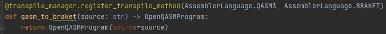

Transpile Manager Documentation
=========================================

Introduction
##############

The transpile manager is the main translation component of the qunicorn system. It allows for translation inbetween various
languages used by the quantum providers.
It does this by searching for a path between two languages in a graph. It then uses the shortest path, as found by a dijkstra algorithm.
The transpile manager is called within the job manager. There a Quantum Circuit is translated into the language of the provider.

Preprocessing Manager
#######################

The Preprocessing Manager handles all preprocessing that is needed to transform a circuit string into a circuit object.
It does this by evaluating either a QISKIT String or a BRAKET String and transforming it into a circuit object.
It then returns this object.

Transpile Manager Structure
############################

Currently Supported Languages
--------------------------------

* QASM2
* QASM3
* QISKIT
* BRAKET
* QUIL

**Note:** (QUIL Transpilation needs to be enabled by setting ENABLE_EXPERIMENTAL_FEATURES in .env to True.)

Currently Supported Transpile Strategies
-----------------------------------------

This graphic visualizes the currently available transpile strategies between the different languages.

.. image:: ../resources/images/transpile_strategys.png

Extending the Transpile Manager
###############################

Steps on how to extend the transpile manager with new languages.

1. Extend the AssemblerLanguage Enum by the new language
2. Create transpile methods in the transpile manager
    1. The new language should be able to be translated into at least one of the already existing languages. A method each for back and forth translation should be created.
    2. Create the new method. Should take input language as input and return the desired language in the output.
    3. Annotate the new method with: "@transpile_manager.register_transpile_method(INPUT_LANGUAGE_ENUM, OUTPUT_LANGUAGE_ENUM)"
3. Add your new language to supported Pilots.
4. Done!

