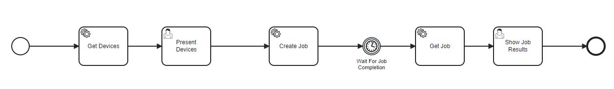

Use Cases
=========

To demo/show and test the application with use cases, the Workflow Modeler is needed.
The Workflow Modeler is a web application that can be used to create and edit workflows.
It can be found in the following repository: https://github.com/PlanQK/workflow-modeler

To create a use case you can start the Docker Compose from the `Use Case repository <https://github.com/SeQuenC-Consortium/SeQuenC-UseCases/>`_.

The following services should now be available:

* qunicorn: `localhost:5005/swagger-ui/ <http://localhost:5005/swagger-ui/>`_
* workflow-modeler: `localhost:8080/ <http://localhost:8080/>`_
* camunda: `localhost:8078/camunda/app/ <http://localhost:8078/camunda/app/>`_

To create a new use case check the README of the `Use Case repository <https://github.com/SeQuenC-Consortium/SeQuenC-UseCases/>`_.

Example Use Case: Get Devices and Create Job
--------------------------------------------

1. Get all devices
2. UserTask: Let the user evaluate the results, the user can now select a device
3. Create a job with the chosen device, and other user inputs
4. Get the results/details of the job
5. UserTask: Let the user evaluate the results

