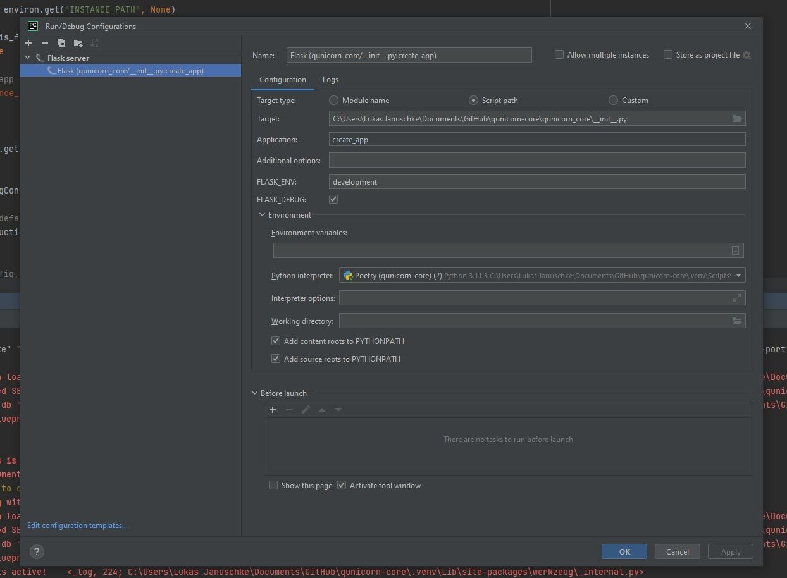
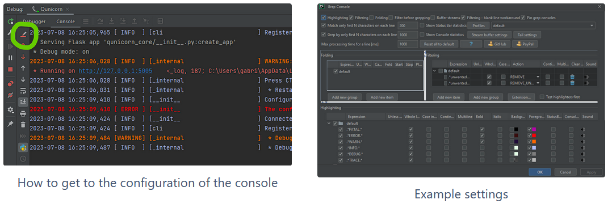

Configure Pycharm - Developer Guide
===================================

1. As a student, you can get the license for free via the Git Developer Pack

2. Assumption: The Qunicorn core repository has already been cloned.

3. Assumption: Poetry and Python have already been set up as in the step above

4. Overwrite IBM_TOKEN="yourToken" and EXECUTE_CELERY_TASK_ASYNCHRONOUS="Boolean" in .env file

5. Ctrl + Shift + A → Search for "Switch Python Interpreter" → Select Poetry Python version

6. Ctrl + Shift + A → Search for "Plugins" → Switch to the Marketplace (top center)

    a. Install Grep Console

    b. Diagrams.net integration (if you want to generate domain models)

    c. EnvFile and Requirements. For correct highlighting in .env and .flaskenv and better integration

7. Customize code style:

8. Double-click on ./instance/qunicorn_core.db to automatically configure a database connection that can be searched and manipulated

9. Configure debugger and logger from the following paragraphs

Configure Debugger for Pycharm
------------------------------

Run → Edit Configurations → Add the configuration parameters from the image

Configure Logger Terminal
-------------------------

1. If you start the app using the configuration described above, all logs are displayed in red.

2. The Grep-Console plugin (in Pycharm) can be used to color the different logging types differently.

3. If this has been installed, the app can be started in debug mode, for example, and the different colors can then be adjusted in the Grep-Console settings

4. With "Rehighlight-Your-Console" the customization can be "tested" directly

How to open the database
------------------------

1. Double-click on ./instance/qunicorn_core.db to automatically configure a database connection that can be searched and manipulated

How to open the database
------------------------

1. Double-click on ./instance/qunicorn_core.db to automatically configure a database connection that can be searched and manipulated

2. How to display the domain model of the database: rightclick at the database tab on main -> diagrams -> show diagrams

How to check if the pipeline will succeed
-----------------------------------------

1. poetry run invoke check-linting

    a. If black fails fix it with: poetry run black .

    b. If flake8 fails fix it with: poetry run flake8

2. poetry run pytest ./tests/automated_tests/

How to test the user authentication
-----------------------------------

Checkout the Keycloak documentation under :doc:`Keycloak Authentication <../architecture_documentation/authentication>`

How to write documentation
--------------------------

Use Read the docs for that: :doc:`Read The Docs Documentation <./rtd_setup_testing>`

Other useful commands
----------------------

To add some flask or invoke commands checkout the documentation: :doc:`Useful Commands <./useful_commands>`

