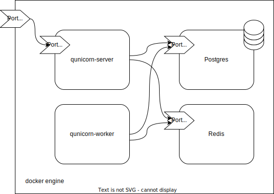

Run using docker-compose
=========================================
Execute the following command the deployment will be started using docker-compose. This will build the dockerimage
containing the application and creates all required containers including the database and the message queue.

Note that you might need to authorize with an Access Token in order to access the qunicorn package on GitHub.
In this Case the following steps need to be performed.

1. Create a personal access token on Github (Account --> Settings --> Developer Settings --> Personal acces tokens)
    Make sure you have the following permissions: read:packages
2. Execute:

.. code-block:: bash

   echo PUT_PERSONAL_ACCESS_TOKEN_HERE | docker login ghcr.io -u USERNAME --password-stdin

Start the docker-compose:

.. code-block:: bash

  docker-compose up -d

For testing with a local build use:

.. code-block:: bash

    docker-compose -f docker-compose.yaml -f docker-compose.local.yaml up -d

